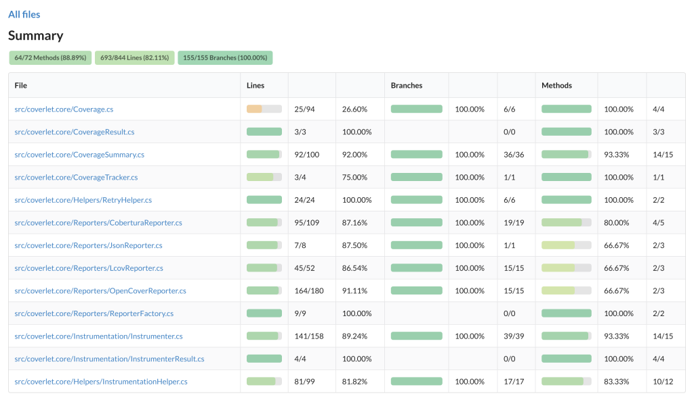
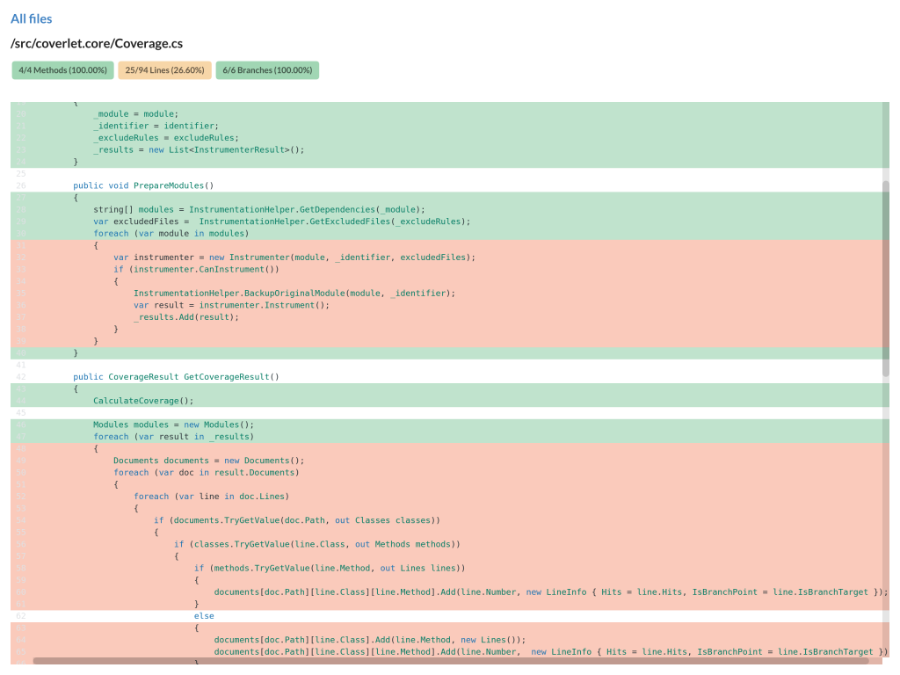

# Coverage Viewer

[![npm version][npm-version-image]][npm-version-url]
[![Build Status][travis-image]][travis-url]
[![Coverage][coveralls-image]][coveralls-url]

Turn your code coverage output into a website for exploring your project's coverage statistics more easily:




## Installation

```
npm i -g coverage-viewer
```

## Usage

Currently only tested with C# coverlet JSON output.

CLI Usage:

```
Usage: coverage-viewer <coverageFile> [options]

Options:
  -s             The root of your project's source code directory     [required]
  -o             Where coverage-viewer should write output
  -u             Whether to start the express viewing server           [boolean]
  -v, --version  Show version number                                   [boolean]
  -h, --help     Show help                                             [boolean]

Examples:
  coverage-viewer coverage.json -s ./src -o ./coverage
```

Using the `-u` flag, you can run an express app to view the output, and automatically re-run the generator if the coverage file changes.

```
coverage-viewer coverage.json -s ./src -o ./coverage -u
```

Once you've generated the output, serve it with your preferred server:

```
npm i -g httpserver
cd coverage
httpserver
```

## License

MIT © [Forrest Desjardins](https://github.com/fdesjardins)

[npm-version-image]: https://img.shields.io/npm/v/coverage-viewer.svg
[npm-version-url]: https://www.npmjs.com/package/coverage-viewer
[travis-url]: https://travis-ci.org/fdesjardins/coverage-viewer
[travis-image]: https://img.shields.io/travis/fdesjardins/coverage-viewer.svg?style=flat
[coveralls-url]: https://coveralls.io/r/fdesjardins/coverage-viewer
[coveralls-image]: https://img.shields.io/coveralls/fdesjardins/coverage-viewer.svg?style=flat
